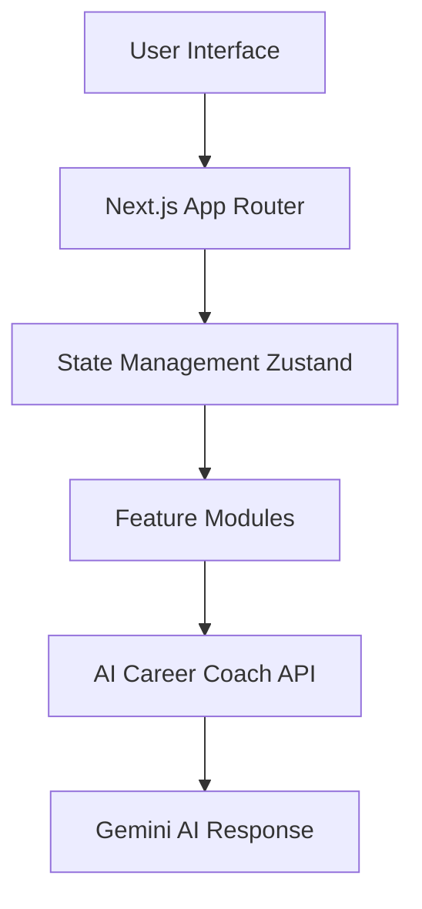

# Architecture

## Project Directory Structure
```text
solo-leveler-ai-tracker
│
├── README.md
├── package.json
├── next.config.ts
├── tailwind.config.ts
│
├── src
│   ├── app
│   │   ├── page.tsx
│   │   └── api
│   │        └── coach
│   │            └── route.ts
│   │
│   ├── features
│   │   ├── onboarding
│   │   ├── skills
│   │   └── ai-coach
│   │
│   ├── shared
│   │   ├── components
│   │   ├── hooks
│   │   └── store
│   │
│   └── styles
│
├── public
│   └── images
│
├── assets
│   ├── demo.gif
│   └── dashboard.png
│
└── docs
    └── architecture.md
```

## Application Flow Architecture

